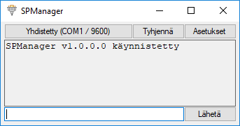
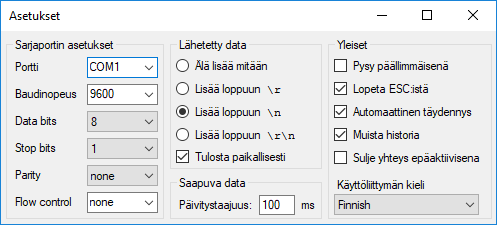

# SPManager

C# serial port manager GUI. Allows sending and receiving data from COM / serial ports.

_Language in images is finnish. Locale support WIP._

## Getting started

### Prerequisites
* Visual Studio 2017
* .NET Framework 4.6.1 (_I think we can go lower_)

## Project goals

- [x] Design
- [ ] Just about everything else (communicating with the ports)

## thank you'ses
* CompuPhase [Termite](https://www.compuphase.com/software_termite.htm#_) for the design, great application btw!
